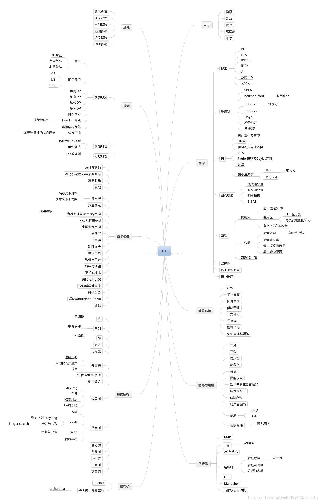

# 算法学习路径

## 前记

### 相关链接

- [`C++ 笔记 (语法/STL)`](Cpp_notes.md)

- [`数学/代码 技巧`](Cpp_notes.md)

- [`灵茶山艾府笔记 - 基础算法`](0X3F(灵茶山艾府)_Notes.md)

- [`疑问/待学知识点`](Questions.md)

### 阅读须知

- 视频由于版权原因 (`ACWing 教学视频`), 未上传至 `Github`

- 单期视频存在多个知识点, 视频附在第一个知识点上

- 前缀 * 表示内容较为重要. 后缀 `done` 表示已经学完, `up` 表示待提升, 空则表示 未学/未接触 过

### 路径总览

## 一. 基础知识点

### 基础算法

- [排序](E:/Algorithm/course/ACWing/02-算法基础课/02-第一章%20基础算法（一）.mp4) `done`

- 二分 `done`

- [高精度](E:/Algorithm/course/ACWing/02-算法基础课/02-第一章%20基础算法（二）.mp4)

- 前缀和与差分

- [双指针算法](E:/Algorithm/course/ACWing/02-算法基础课/02-第一章%20基础算法（三）.mp4) `up`

- 位运算

- 离散化

- 区间合并

### 数据结构

- [链表与邻接表：树与图的存储](E:/Algorithm/course/ACWing/02-算法基础课/02-第二章%20数据结构（一）.mp4) `up`

- 栈与队列：单调队列、单调栈 `up`

- kmp

- [Trie 字典树](E:/Algorithm/course/ACWing/02-算法基础课/02-第二章%20数据结构（二）.mp4)

- 并查集

- 堆

- [Hash表](E:/Algorithm/course/ACWing/02-算法基础课/02-第二章%20数据结构（三）.mp4) `up`

- C++ STL 技巧

### 搜索与图论

- [DFS与BFS](E:/Algorithm/course/ACWing/02-算法基础课/02-第三章%20搜索与图论（一）.mp4) `up`

- 树与图的遍历：拓扑排序 `up`

- [最短路](E:/Algorithm/course/ACWing/02-算法基础课/02-第三章%20搜索与图论（二）.mp4) `up`

- [最小生成树](E:/Algorithm/course/ACWing/02-算法基础课/02-第三章%20搜索与图论（三）.mp4) `up`

- 二分图：染色法、匈牙利算法 `up`

### 数学知识

- [质数](E:/Algorithm/course/ACWing/02-算法基础课/02-第四章%20数学知识（一）.mp4) `up`

- 约数 `up`

- [欧拉函数](E:/Algorithm/course/ACWing/02-算法基础课/02-第四章%20数学知识（二）.mp4)

- 快速幂 `up`

- 扩展欧几里得算法

- 中国剩余定理

- [高斯消元](E:/Algorithm/course/ACWing/02-算法基础课/02-第四章%20数学知识（三）.mp4)

- 组合计数 `up`

- [容斥原理](E:/Algorithm/course/ACWing/02-算法基础课/02-第四章%20数学知识（四）.mp4) `done`

- 简单博弈论 `done`

### 动态规划

- [背包问题](E:/Algorithm/course/ACWing/02-算法基础课/02-第五章%20动态规划（一）.mp4) `up`

- [线性DP](E:/Algorithm/course/ACWing/02-算法基础课/02-第五章%20动态规划（二）.mp4) `up`

- 区间DP `up`

- 计数类DP

- [数位统计DP](E:/Algorithm/course/ACWing/02-算法基础课/02-第五章%20动态规划（三）.mp4)

- 状态压缩DP

- 树形DP `up`

- 记忆化搜索 `up`

### 贪心

- [贪心策略上](E:/Algorithm/course/ACWing/02-算法基础课/02-第六章%20贪心算法（一）.mp4) `up`

- [贪心策略下](E:/Algorithm/course/ACWing/02-算法基础课/02-第六章%20贪心算法（二）.mp4) `up`

### 时空复杂度分析

- [时空复杂度分析](E:/Algorithm/course/ACWing/02-算法基础课/02-第七章%20时空复杂度分析.mp4) `done`

## 二. 提高知识点

### 1. 动态规划——从集合角度考虑DP问题

- 1.1 数字三角形模型

- 1.2 最长上升子序列模型

- 1.3 背包模型

- 1.4 状态机模型

- 1.5 状态压缩DP

- 1.6 区间DP

- 1.7 树形DP

- 1.8 数位DP

- 1.9 单调队列优化的DP问题

- 1.10 斜率优化的DP问题

### 2. 搜索

- 2.1 BFS

- 2.1.1 Flood Fill

- 2.1.2 最短路模型

- 2.1.3 多源BFS

- 2.1.4 最小步数模型

- 2.1.5 双端队列广搜

- 2.1.6 双向广搜

- 2.1.7 A*

- 2.2 DFS

- 2.2.1 连通性模型

- 2.2.2 搜索顺序

- 2.2.3 剪枝与优化

- 2.2.4 迭代加深

- 2.2.5 双向DFS

- 2.2.6 IDA*

### 3. 图论

- 3.1.1 单源最短路的建图方式

- 3.1.2 单源最短路的综合应用

- 3.1.3 单源最短路的扩展应用

- 3.2 floyd算法及其变形

- 3.3.1 最小生成树的典型应用

- 3.3.2 最小生成树的扩展应用

- 3.4 SPFA求负环

- 3.5 差分约束

- 3.6 最近公共祖先

- 3.7 有向图的强连通分量

- 3.8 无向图的双连通分量

- 3.9 二分图

- 3.10 欧拉回路和欧拉路径

- 3.11 拓扑排序

### 4. *高级数据结构

- 4.1 并查集

- 4.2 树状数组

- 4.3.1 线段树（一）

- 4.3.2 线段树（二）

- 4.4 可持久化数据结构

- 4.5 平衡树——Treap

- 4.6 AC自动机

### 5. 数学知识

- 5.1 筛质数

- 5.2 分解质因数

- 5.3 快速幂

- 5.4 约数个数

- 5.5 欧拉函数

- 5.6 同余

- 5.7 矩阵乘法

- 5.8 组合计数

- 5.9 高斯消元

- 5.10 容斥原理

- 5.11 概率与数学期望

- 5.12 [博弈论](E:/Algorithm/course/ACWing/03-算法提高课/05-第五章%20数学知识/8.博弈论.MP4)

### 6. 基础算法

- 6.1 位运算

- 6.2 递归

- 6.3 前缀和与差分

- 6.4 二分

- 6.5 排序

- 6.6 RMQ

## 三. 进阶知识点

### 1. 图论

- 1.1 网络流

- 1.1.1 最大流

- 1.1.1.1 算法模板

- 1.1.1.2 二分图匹配

- 1.1.1.3 上下界可行流

- 1.1.1.4 多源汇最大流

- 1.1.1.5 关键边

- 1.1.1.6 最大流判定

- 1.1.1.7 拆点

- 1.1.1.8 建图实战

- 1.1.2 最小割

- 1.1.2.1 算法模板

- 1.1.2.2 直接应用

- 1.1.2.3 最大权闭合图

- 1.1.2.4 最大密度子图

- 1.1.2.5 最小点权覆盖集

- 1.1.2.6 最大点权独立集

- 1.1.2.7 建图实战

- 1.1.3 费用流

- 1.1.3.1 算法模板

- 1.1.3.2 直接应用

- 1.1.3.3 二分图最优匹配

- 1.1.3.4 最大权不相交路径

- 1.1.3.5 网格图模型

- 1.1.3.6 拆点

- 1.1.3.7 上下界可行流

- 1.2 2-SAT

- 1.3 朱刘算法

- 1.4 Prufer编码

### 2. 数据结构

- 2.1 Splay（一）

- 2.2 Splay（二）

- 2.3 树套树

- 2.4 分块之基本思想、块状链表

- 2.5 莫队（一）

- 2.6 莫队（二）

- 2.7 树链剖分

- 2.8 动态树

- 2.9 Dancing Links（一）

- 2.10 Dancing Links（二）

- 2.11 左偏树

- 2.12 后缀数组

- 2.13 后缀自动机

- 2.14 点分治和点分树

- 2.15 CDQ分治

- 2.16 仙人掌

### 3. 动态规划

- 3.1 基环树DP

- 3.2 四边形不等式优化

- 3.3 插头DP

### 4. 计算几何

- 4.1 二维计算几何基础

- 4.2 凸包

- 4.3 半平面交

- 4.4 最小圆覆盖

- 4.5 三维计算几何基础

- 4.6 三维凸包

- 4.7 旋转卡壳

- 4.8 三角剖分

- 4.9 扫描线

- 4.10 自适应辛普森积分

### 5. 数学

- 5.1 莫比乌斯反演

- 5.2 积性函数

- 5.3 BSGS

- 5.4 FFT

- 5.5 生成函数

- 5.6 Burnside引理和Polya定理

- 5.7 斯特林数

- 5.8 线性基

### 6. 搜索

- 6.1 模拟退火

- 6.2 爬山法

### 7. 基础算法

- 7.1 启发式合并

- 7.2 manacher算法

- 7.3 最小表示法

- 7.4 构造

- 7.5 打表

## 后记

### 声明

- 图片搬运至 `CSDN`, 详见图片水印

- 路径规划参考 `ACWing` 课程安排
